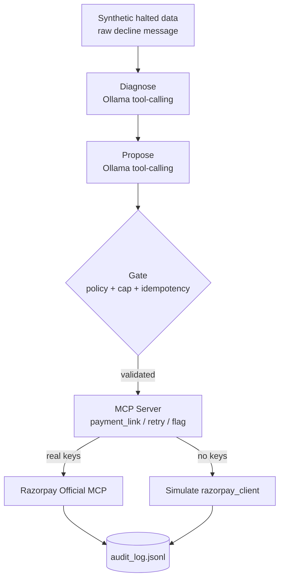

# Recoup — Razorpay Revenue Recovery Agent

[](https://github.com/MrNK2107/FailSafe/actions/workflows/tests.yml)
[](LICENSE)
[](requirements.txt)

> **Track 3 — AI Revenue Recovery.** A gated, audited agent that recovers revenue where Razorpay's own retries stop.

---

## Table of Contents

- [Overview](#overview)
- [Architecture](#architecture)
- [Domains](#domains)
- [Results](#results)
- [Limitations](#limitations)
- [Quick Start](#quick-start)
- [Usage](#usage)
- [Testing](#testing)
- [Project Structure](#project-structure)
- [Documentation](#documentation)

---

## Overview

Razorpay retries a failed recurring payment 3 times over 3 days (T+3). After that the subscription is `halted` — no further automatic attempt is made. **Recoup** fills that gap: it diagnoses why a payment failed, proposes a recovery action via LLM, validates it through a deterministic gate, and executes it with full auditability.

**Core principle:** the LLM *proposes*, deterministic code *decides*. Every proposal is checked against a human-readable policy table and spending caps before touching money.

## Architecture



- **Diagnose** (`src/diagnose.py`): infers `decline_code` from raw bank message only — never sees ground truth.
- **Propose** (`src/ollama_client.py`): LLM proposes a typed action for the diagnosed code.
- **Gate** (`src/gate.py`): deterministic — policy lookup on diagnosed code, spending cap, idempotency, escalation rules. Overrides the LLM when wrong.
- **Execute** (`src/mcp_server.py`): MCP tools with independent tool-level cap. Routes to real Razorpay MCP server when keys are set, else simulates.

Policy is a single editable file: [`config/decline_policy.json`](config/decline_policy.json). Typo fails loudly at startup.

## Domains

| Domain | Data | Gate | Policy |
|---|---|---|---|
| **Halted Subscriptions** | `halted_subscriptions.json` | `gate.py` | `decline_policy.json` |
| **One-Time Payments** | `failed_onetime_payments.json` | `gate.py` (reuse, zero changes) | `decline_policy.json` |
| **Checkout Abandonment** | `abandoned_checkouts.json` | `abandonment_gate.py` | `abandonment_policy.json` |
| **Overdue Receivables** | `overdue_invoices.json` | `receivables_gate.py` | `receivables_policy.json` |

`src/integrated_pipeline.py` dispatches a mixed batch to the correct domain automatically; each domain keeps its own audit trail by design.

## Results

All numbers recomputed from `logs/audit_log.jsonl` — see [`METRICS.md`](METRICS.md).

| Metric | Value |
|---|---|
| Halted subscriptions processed | 150 / 150 |
| Actions executed | 104 / 150 |
| Simulated recovered | ₹41,819.81 / ₹1,50,729.35 |
| LLM match rate | **98%** (147/150) |
| Gate overrides | 2% (3/150) |
| Escalated (stale 12d + 3-attempt cap) | 36 / 150 |
| Real Razorpay objects (test mode) | 34 — verifiable in `dashboard.razorpay.com` |

Paraphrase robustness: 16/16 clean paraphrases pass, 15/16 adversarial pass (one fraud miss contained by gate).

## Limitations

- Detection (`detect.py`) and diagnosis (`diagnose.py`) are proven live on 30-record demos but not wired into the flagship 150-record batch — `halted_subscriptions.json` has no detection signal yet.
- Checkout/receivables are standalone domains with separate gates; the dispatcher routes but does not merge policies.
- Policy dashboard is read-only — editing requires git history for auditability; no live ACL built.
- "Compliant escalation" = bounded/attempt-capped, not TRAI/DND or RBI e-mandate integrated.
- 150 records = 15 unique decline scenarios at `temperature: 0`; diversity comes from paraphrase/adversarial suites.

## Quick Start

```bash
python -m venv .venv
.venv\Scripts\pip install -r requirements.txt

# optional: real Razorpay test keys (no KYC) — else simulate mode
copy .env.example .env   # add rzp_test_ keys

# local model
ollama pull llama3.1:8b
```

## Usage

```bash
cd src

# flagship: halted subscriptions
python generate_data.py
python agent.py                          # writes RESULTS.md + logs/audit_log.jsonl
python agent.py --inject-failure llm_parse_failure

# reports
python generate_report.py                # -> REPORT.html
python generate_policy_dashboard.py      # -> POLICY_DASHBOARD.html

# stretch: one-time payments
python generate_data_onetime.py
python agent_onetime.py

# stretch: route split
python route_demo.py

# stretch: abandonment / receivables
python generate_checkout_abandonment_data.py
python checkout_abandonment_agent.py 30
python generate_receivables_data.py
python receivables_agent.py 30

# integrated: all 4 domains
python integrated_pipeline.py
```

## Testing

```bash
python -m pytest tests/ -v   # 206 tests, no Ollama or keys needed
```

Gate and policy tests are LLM-independent. Ollama failure paths are mocked (`test_ollama_client.py`).

## Project Structure

```
config/          decline/abandonment/receivables policies (JSON)
data/            synthetic datasets
src/             agent, gates, diagnosis, MCP server, clients, generators
tests/           206 tests — gate, policy, idempotency, Ollama mocks
logs/            audit logs + checkpoints (JSONL)
REPORT.html / POLICY_DASHBOARD.html  generated static pages
```

## Documentation

| Doc | Content |
|---|---|
| `BUILD_LOG.md` | Decisions, architecture, protocol, full results |
| `METRICS.md` | Numbers re-derived from raw logs |
| `EASY_EXPLAINER.md` | Plain-language walkthrough |
| `GLOSSARY.md` | Terms |
| `REAL_MCP_RESULTS.md` | Verifiable Razorpay object IDs |

---

**Cost: $0.** Test-mode Razorpay + local Ollama. No paid APIs.

License: MIT
