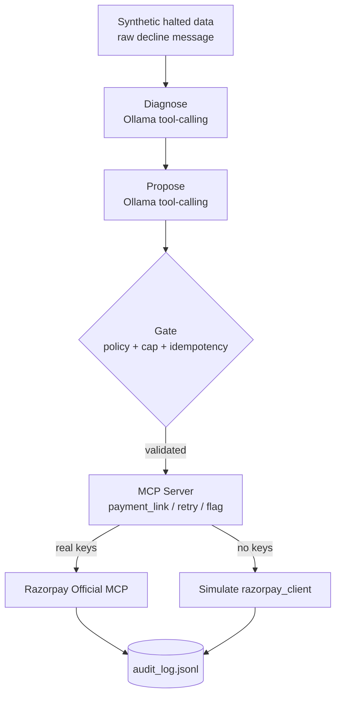

# FailSafe — Razorpay Revenue Recovery Agent

[](https://github.com/MrNK2107/FailSafe/actions/workflows/tests.yml)
[](LICENSE)
[](pyproject.toml)

> **Track 3 — AI Revenue Recovery.** A gated, audited agent that recovers revenue where Razorpay's own retries stop.

---

## Table of Contents

- [Overview](#overview)
- [Architecture](#architecture)
- [Domains](#domains)
- [Results](#results)
- [Limitations](#limitations)
- [Quick Start](#quick-start)
- [Usage](#usage)
- [Testing](#testing)
- [Project Structure](#project-structure)
- [Documentation](#documentation)

---

## Overview

Razorpay retries a failed recurring payment 3 times over 3 days (T+3). After that the subscription is `halted` — no further automatic attempt is made. **FailSafe** fills that gap: it diagnoses why a payment failed, proposes a recovery action via LLM, validates it through a deterministic gate, and executes it with full auditability.

**Core principle:** the LLM *proposes*, deterministic code *decides*. Every proposal is checked against a human-readable policy table and spending caps before touching money.

## Architecture



- **Diagnose** (`src/failsafe/diagnose.py`): infers `decline_code` from raw bank message only — never sees ground truth.
- **Propose** (`src/failsafe/ollama_client.py`): LLM proposes a typed action for the diagnosed code.
- **Gate** (`src/failsafe/gate.py`): deterministic — policy lookup on diagnosed code, spending cap, idempotency, escalation rules. Overrides the LLM when wrong.
- **Execute** (`src/failsafe/mcp_server.py`): MCP tools with an independent tool-level cap. Routes to the real Razorpay MCP server when keys are set, else simulates.

Policy is a single editable file: [`config/decline_policy.json`](config/decline_policy.json). A typo fails loudly at startup.

## Domains

| Domain | Data | Gate | Policy |
|---|---|---|---|
| **Halted Subscriptions** | `data/halted_subscriptions.json` | `gate.py` | `decline_policy.json` |
| **One-Time Payments** | `data/failed_onetime_payments.json` | `gate.py` (reused unchanged) | `decline_policy.json` |
| **Checkout Abandonment** | `data/abandoned_checkouts.json` | `abandonment_gate.py` | `abandonment_policy.json` |
| **Overdue Receivables** | `data/overdue_invoices.json` | `receivables_gate.py` | `receivables_policy.json` |

`python -m failsafe integrated` dispatches a mixed batch to the correct domain automatically; each domain keeps its own audit trail by design.

## Results

All numbers are **computed from the committed audit logs** by [`scripts/metrics.py`](scripts/metrics.py) — regenerate them yourself:

```bash
python scripts/metrics.py
```

Flagship highlights (see [METRICS.md](METRICS.md) for all four domains, definitions, and caveats):

| Metric | Value |
|---|---|
| Records processed (flagship) | 150 |
| LLM policy match rate | **98%** (320/326 gate decisions) |
| Gate overrides of the LLM | 2% |
| Diagnosis accuracy (vs ground truth) | 82% |
| Escalated by stopping rules | 74 |

Real Razorpay objects created in test mode: 5 — with verifiable IDs in [REAL_MCP_RESULTS.md](REAL_MCP_RESULTS.md).

Paraphrase robustness: 16/16 clean paraphrases pass; 15/16 adversarial (the one fraud miss was contained by the gate).

## Limitations

- Detection (`detect.py`) and diagnosis are proven on live 30-record demos but not wired into the flagship batch — `halted_subscriptions.json` has no detection signal yet.
- Checkout/receivables are standalone domains with separate gates; the dispatcher routes but does not merge policies.
- Policy dashboard is read-only — editing requires git history for auditability; no live ACL built.
- "Compliant escalation" = bounded/attempt-capped, not TRAI/DND or RBI e-mandate integrated.
- 150 records = 15 unique decline scenarios at `temperature: 0`; diversity comes from paraphrase/adversarial suites.
- Audit logs written before the FailSafe rename carry the old `source=recovery-agent` Razorpay notes tag.

## Quick Start

```bash
# 1. Python 3.10+ and a virtual environment
python -m venv .venv
source .venv/bin/activate        # Windows: .venv\Scripts\activate

# 2. Install (use .venv/Scripts/pip on Windows)
pip install -e .

# 3. Optional: real Razorpay TEST-MODE keys (free, no KYC) — else simulate mode
copy .env.example .env           # Windows; on macOS/Linux: cp .env.example .env

# 4. Local model (no paid APIs anywhere)
ollama pull llama3.1:8b
```

## Usage

One dispatcher for every pipeline stage:

```bash
# flagship: halted subscriptions
python -m failsafe generate-data
python -m failsafe agent                                   # writes RESULTS.md + logs/audit_log.jsonl
python -m failsafe agent --inject-failure llm_parse_failure  # demo a graceful-degradation path live

# reports
python -m failsafe report        # -> REPORT.html
python -m failsafe dashboard     # -> POLICY_DASHBOARD.html

# stretch domains
python -m failsafe generate-data-onetime && python -m failsafe agent-onetime
python -m failsafe generate-checkout-abandonment && python -m failsafe checkout-abandonment 30
python -m failsafe generate-receivables && python -m failsafe receivables 30

# integrated: all 4 domains in one dispatch loop
python -m failsafe integrated

# demos
python -m failsafe detect-demo
python -m failsafe diagnose-demo
python -m failsafe route-demo
python -m failsafe real-mcp-demo 5    # requires real rzp_test_ keys
```

## Testing

```bash
pytest tests/ -v          # 206 tests, ~2s, no Ollama or keys needed
ruff check src/ tests/    # lint
ruff format --check .     # formatting
```

Gate and policy tests are LLM-independent; Ollama failure paths are mocked.

## Project Structure

```
pyproject.toml    package metadata, pinned deps, tool config
src/failsafe/     agent, gates, diagnosis, MCP server, clients, generators
config/           decline/abandonment/receivables policies (JSON)
data/             synthetic datasets
tests/            206 tests — gate, policy, idempotency, Ollama mocks
scripts/          metrics.py — recompute every reported number from the logs
logs/             audit logs + checkpoints (JSONL, append-only)
```

## Documentation

| Doc | Content |
|---|---|
| [METRICS.md](METRICS.md) | Numbers re-derived from raw logs, with definitions and caveats |
| [BUILD_LOG.md](BUILD_LOG.md) | Project history, key decisions, and the overhaul record |
| [EASY_EXPLAINER.md](EASY_EXPLAINER.md) | Plain-language walkthrough |
| [GLOSSARY.md](GLOSSARY.md) | Terms |
| [REAL_MCP_RESULTS.md](REAL_MCP_RESULTS.md) | Verifiable Razorpay test-mode object IDs |

---

**Cost: ₹0.** Test-mode Razorpay + local Ollama. No paid APIs.

License: MIT
